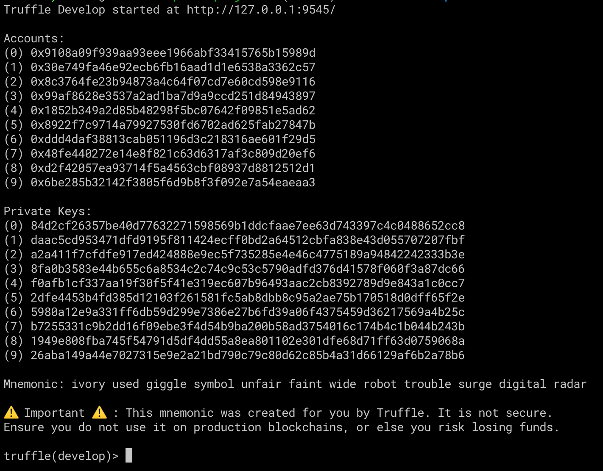
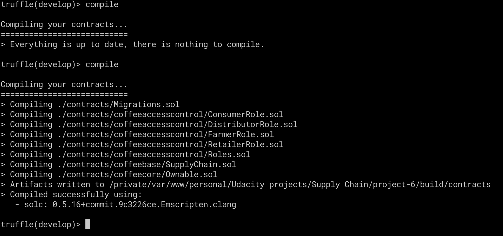
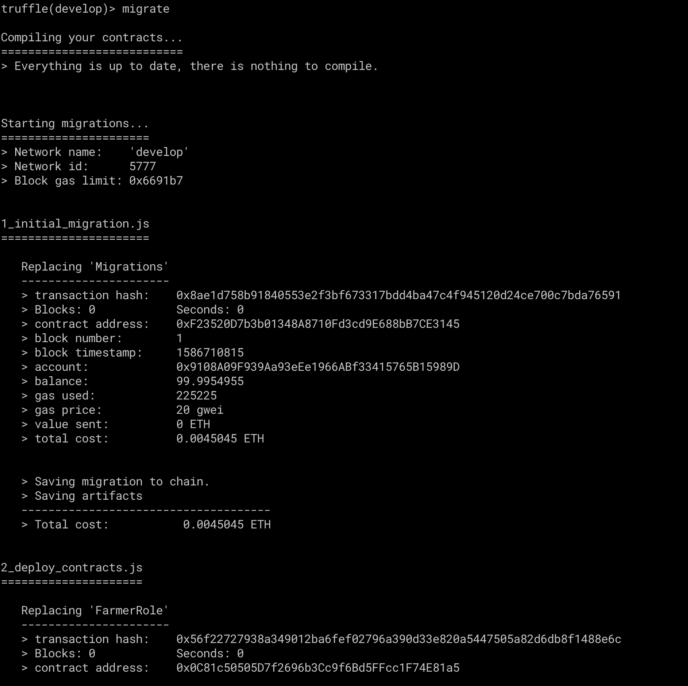
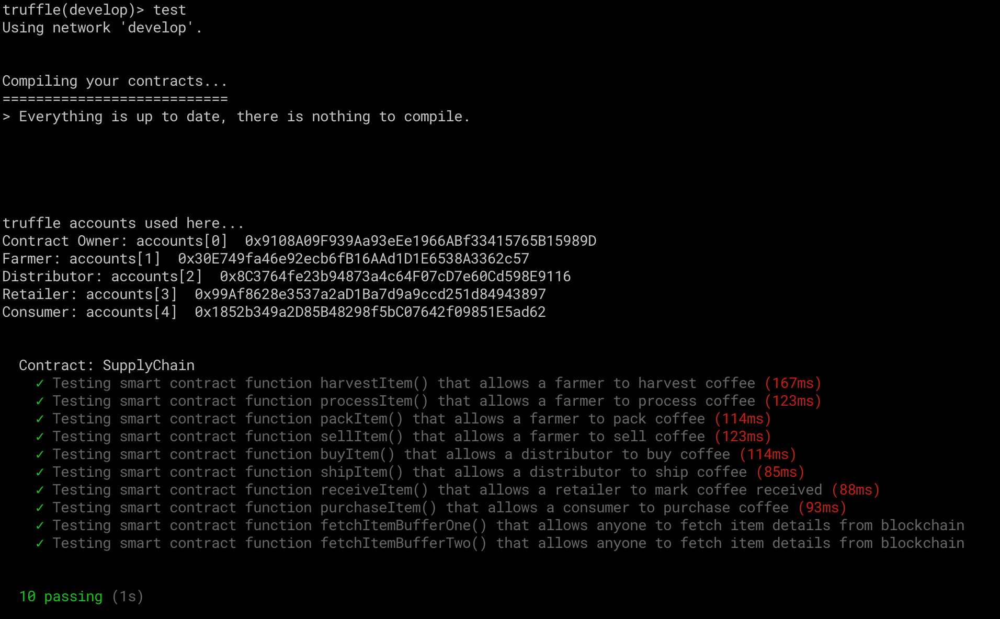

# Supply chain & data auditing

This repository containts an Ethereum DApp that demonstrates a Supply Chain flow between a Seller and Buyer. The user story is similar to any commonly used supply chain process. A Seller can add items to the inventory system stored in the blockchain. A Buyer can purchase such items from the inventory system. Additionally a Seller can mark an item as Shipped, and similarly a Buyer can mark an item as Received.

The DApp User Interface when running should look like...


## Getting Started

These instructions will get you a copy of the project up and running on your local machine for development and testing purposes. See deployment for notes on how to deploy the project on a live system.

### Prerequisites

Please make sure you've already installed Truffle and enabled MetaMask extension in your browser.

```
truffle version
```

### Installing

A step by step series of examples that tell you have to get a development env running

Clone this repository:

```
git clone https://github.com/stiffroy/supply-chain-dapp.git
```

Change directory to ```supply-chain-dapp``` folder and install all requisite npm packages (as listed in ```package.json```):

```
cd supply-chain-dapp
npm install
```

Launch Truffle:

```
truffle develop
```

Your terminal should look something like this:



Compile smart contracts in the cli mode:

```
compile
```

Your terminal should look something like this:



This will create the smart contract artifacts in folder ```build\contracts```.

Migrate smart contracts to the locally running blockchain, truffle:

```
migrate
```

Your terminal should look something like this:



Test smart contracts:

```
test
```

All 10 tests should pass.



In a separate terminal window, launch the DApp:

```
npm run dev
```

## Built With

* [Ethereum](https://www.ethereum.org/) - Ethereum is a decentralized platform that runs smart contracts
* [IPFS](https://ipfs.io/) - IPFS is the Distributed Web | A peer-to-peer hypermedia protocol
to make the web faster, safer, and more open.
* [Truffle Framework](http://truffleframework.com/) - Truffle is the most popular development framework for Ethereum with a mission to make your life a whole lot easier.


## Deployment details of Rinkeby
Main smart contract (SupplyChain):

Transaction ID: [0xed7eee77a62bdf758e3bcb2d1357f483cda2479bd17f8cfa1e13435daa00962d](https://rinkeby.etherscan.io/tx/0xed7eee77a62bdf758e3bcb2d1357f483cda2479bd17f8cfa1e13435daa00962d)

Contract address: [0x56c40A90F26e4611D903a54501Ea32e711731e34](https://rinkeby.etherscan.io/address/0x56c40a90f26e4611d903a54501ea32e711731e34)
```
    Deploying 'SupplyChain'
    -----------------------
    > transaction hash:    0x1f8708c0902bcf214f451bad46bc1c0068eccb0c0a54083e9f7403abb22aa32f
    > Blocks: 0            Seconds: 8
    > contract address:    0xfB46f070d98E8aAcd9E697e0a94C7e82d48a39EA
    > block number:        6314516
    > block timestamp:     1586873006
    > account:             0x327Cf41edC0eb2c516793F1901E2F46AF824C795
    > balance:             21.620309878
    > gas used:            2660755
    > gas price:           10 gwei
    > value sent:          0 ETH
    > total cost:          0.02660755 ETH
```

Supporting contracts:

FarmerRole:
```
    Deploying 'FarmerRole'
    ----------------------
    > transaction hash:    0x67a0bd39ad68eeb18b185b5c4292c1e889baf001014c35f21e638c598af49895
    > Blocks: 1            Seconds: 8
    > contract address:    0x3eD50bE0261C60CCC4a5f6cCeaA472eaD2d8b8B4
    > block number:        6314512
    > block timestamp:     1586872946
    > account:             0x327Cf41edC0eb2c516793F1901E2F46AF824C795
    > balance:             21.656099708
    > gas used:            306084
    > gas price:           10 gwei
    > value sent:          0 ETH
    > total cost:          0.00306084 ETH
```

DistributorRole:
```
    Deploying 'DistributorRole'
    ---------------------------
    > transaction hash:    0x025f25c498ea9f37e9fdbf64dc354ce43a4d71a12e8541d6442ddc827a797a7d
    > Blocks: 0            Seconds: 8
    > contract address:    0xF4A4b7d2879aF747eC04A3719EBC7E295Fc2Ce14
    > block number:        6314513
    > block timestamp:     1586872961
    > account:             0x327Cf41edC0eb2c516793F1901E2F46AF824C795
    > balance:             21.653038988
    > gas used:            306072
    > gas price:           10 gwei
    > value sent:          0 ETH
    > total cost:          0.00306072 ETH
```

RetailerRole:
```
    Deploying 'RetailerRole'
    ------------------------
    > transaction hash:    0x416b3b738bdfdaa4ec6e400fad5bb61a51841e71224cc0dee6b27a4060aff122
    > Blocks: 0            Seconds: 8
    > contract address:    0xA0883793728efC5A228Bf0Ab111461Dda9846d5F
    > block number:        6314514
    > block timestamp:     1586872976
    > account:             0x327Cf41edC0eb2c516793F1901E2F46AF824C795
    > balance:             21.649978148
    > gas used:            306084
    > gas price:           10 gwei
    > value sent:          0 ETH
    > total cost:          0.00306084 ETH
```

ConsumerRole:
```
    Deploying 'ConsumerRole'
    ------------------------
    > transaction hash:    0x3a7f2b9312c3c681d34fe100dcbf28b90cb74b5992ef281db942f62dc3882573
    > Blocks: 0            Seconds: 8
    > contract address:    0xBA7ef6Ba0EB0C9514ae46e23E5f6Ee7A8001CC8D
    > block number:        6314515
    > block timestamp:     1586872991
    > account:             0x327Cf41edC0eb2c516793F1901E2F46AF824C795
    > balance:             21.646917428
    > gas used:            306072
    > gas price:           10 gwei
    > value sent:          0 ETH
    > total cost:          0.00306072 ETH
```

## Acknowledgments

* Solidity
* Ganache-cli
* Truffle
* IPFS
